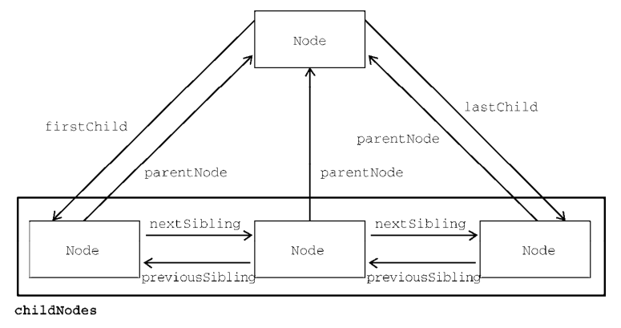

## 事件模型
事件: 指在HTML文档或者浏览器中发生的一种交互操作，使得网页具备互动性

事件流: 事件捕获阶段（capture phase） -> 处于目标阶段（target phase） -> 事件冒泡阶段（bubbling phase）


事件模型:

- DOM0级事件模型

```js
var btn = document.getElementById('.btn')

btn.onclick = fun

btn.onclick = null  // 删除DOM0级事件处理程序

```

- DOM2级事件模型

```js
var btn = document.getElementById('.btn')

btn.addEventListener(‘click’, showMessage, false)
btn.removeEventListener(‘click’, showMessage, false)

```

## 事件委托
事件代理：将一个或者一组元素的事件委托到它的父层或者更外层元素上，真正绑定事件的是外层元素，而不是目标元素

使用事件委托的优势:

- 减少整个页面所需的内存，提升整体性能

- 动态绑定，减少重复工作

## DOM操作
- 创建节点
  - document.createElement()
  - document.createTextNode()
  - document.createDocumentFragment()
  - document.createAttribute()

> 文档碎片表示一种轻量级的文档，主要是用来存储临时节点，批量修改后一次性添加到DOM中

- 查询节点
  - document.querySelector()
  - document.querySelectorAll() 
  - document.getElementById()
  - document.getElementsByClassName()
  - document.getElementsByTagName()
  - document.getElementsByName()
  - document.documentElement
  - document.body 
  - document.all

> document.querySelectorAll方法返回的是一个`NodeList`的静态实例，它是一个静态的'快照'，而非'实时'的查询

DOM节点的层次关系图:



- 更新节点
  - innerHTML
  - innerText
  - textContent
  - style

> 读取属性时，innerText不返回隐藏元素的文本，而textContent返回所有文本

- 添加节点
  - innerHTML
  - appendChild
  - insertBefore
  - setAttribute

- 删除节点
  - removeChild
  - remove 


## 元素尺寸

> offsetWidth和clientWidth
